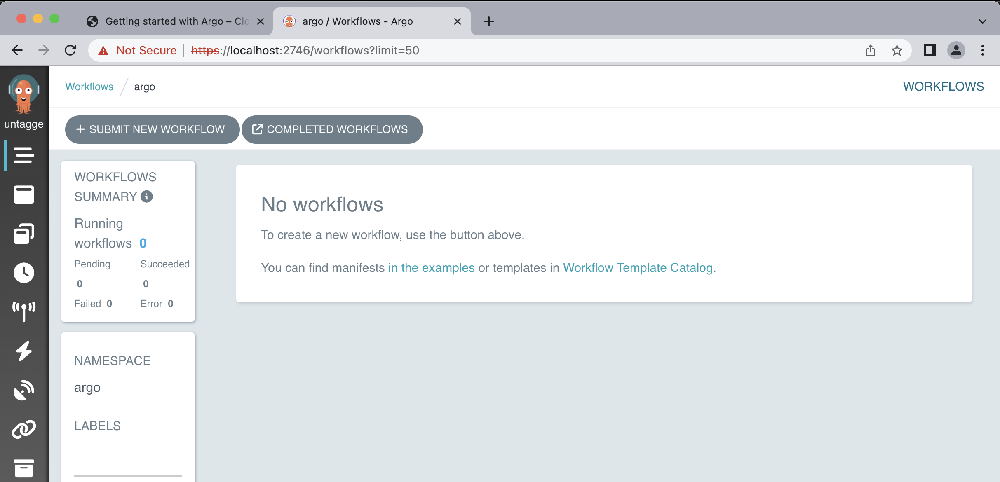
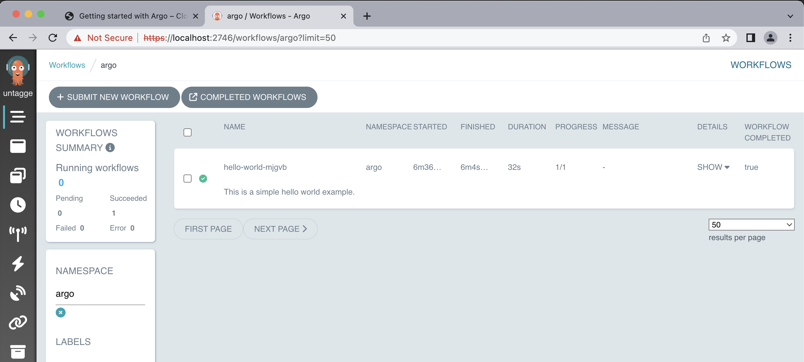
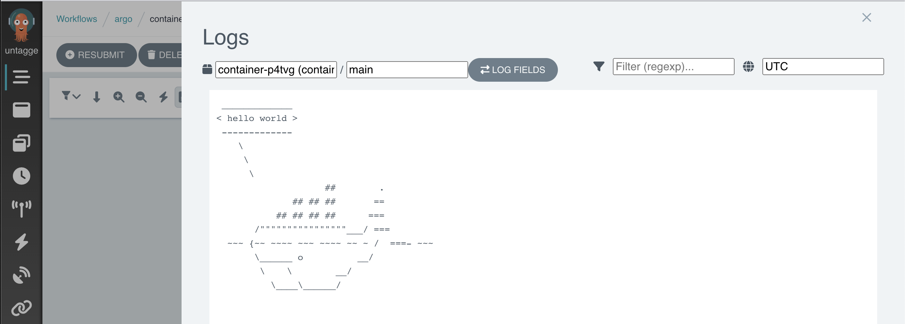

## Argo

Argo is a collection of open-source tools that extend the functionality of Kubernetes, providing several benefits for workflow management. Some key advantages of using Argo include:

* **Cloud Agnostic:** Argo can be deployed on any Kubernetes cluster, irrespective of the underlying cloud provider.
* **Resource Monitoring:** Argo enables constant monitoring of resource states, allowing users to track the progress and status of their workflows.
* **Scalability:** Argo supports the execution of multiple jobs simultaneously across different nodes, providing high scalability.
* **Error Debugging:** With Argo, it is easier to identify and debug errors in workflows, ensuring smooth execution.

In the context of Argo, there are three important tools that facilitate working with workflows, we will be using the Argo Workflow Engine.

## Install the Argo Workflows CLI

Next, Download the latest Argo CLI from the same [releases page](https://github.com/argoproj/argo-workflows/releases/latest). This is a requirement to interact with argo.

### Argo Workflow Engine
The Argo Workflow Engine is designed to execute complex job orchestration, including both serial and parallel execution of stages, with each stage executed as a container.

In the context of scientific analysis, such as physics analysis using datasets from the CMS Open Data portal and CMSSW, Argo's orchestration capabilities are particularly valuable. By leveraging Argo, researchers can automate and streamline complex analysis workflows, which often involve multiple processing stages and dependencies. Argo's support for parallel execution and container-based environments allows for efficient utilization of computational resources, enabling faster and more scalable data analysis.

### Install argo as a workflow engine

While jobs can be run manually, utilizing a workflow engine like Argo simplifies the process of defining and submitting jobs. In this tutorial, we will use the Argo Quick Start page to install and configure Argo in your working environment.

Install it into your working environment with the following commands (all commands to be entered into your local shell):

```bash
kubectl create ns argo
kubectl apply -n argo -f https://raw.githubusercontent.com/argoproj/argo-workflows/master/manifests/quick-start-postgres.yaml
```

You can now check that argo is available with:
              
```bash
argo version
```    

### Port-forward the UI

To open a port-forward so you can access the UI, open a new shell and run:

```bash
kubectl -n argo port-forward deployment/argo-server 2746:2746
```

This will serve the UI on [https://localhost:2746](https://localhost:2746). Due to the self-signed certificate, you will receive a TLS error which you will need to manually approve. The Argo interface has the following similiarity:



In the Argo GUI, you can perform various operations and actions related to managing and monitoring Argo Workflows. Here are some of the things you can do in the Argo GUI with Argo Workflows:
- View Workflows
- Submit Workflows
- Monitor Workflow Status
- Inspect Workflow Details
- View Workflow Logs
- Re-run Workflows
- Cancel Workflows
- Visualize Workflow DAG (Directed Acyclic Graph)
- Manage Workflow Templates

> Pay close attention to the URI. It uses `https` and not `http`. Navigating to `http://localhost:2746` result in server-side error that breaks the port-forwarding.
{: .testimonial}


### Run a simple test workflow
Make sure that all argo pods are running before submitting the test workflow:
```bash
kubectl get pods -n argo
```
You must get a similar output:
```output
NAME                                  READY   STATUS      RESTARTS        AGE
argo-server-76f9f55f44-9d6c5          1/1     Running     6 (5d14h ago)   23d
httpbin-7d6678b4c5-vhk2k              1/1     Running     3 (5d14h ago)   23d
minio-68dc5544c4-8jst4                1/1     Running     3 (5d14h ago)   23d
postgres-6f9cb49458-sc5fx             1/1     Running     3 (5d14h ago)   23d
workflow-controller-769bfc84b-ndgp7   1/1     Running     8 (13m ago)     23d
```

To test the setup, run a simple test workflow with:
```bash
argo submit -n argo https://raw.githubusercontent.com/argoproj/argo/master/examples/hello-world.yaml
```
         
This might take a while, to see the status of our workflows run:
```bash
argo list @latest -n argo 
```
> ## Output
> The output you provided indicates that there is a pod named "hello-world-mjgvb" that has a status of "Succeeded". The pod has been running for 2 minutes, and it took 32 seconds to complete its execution. The priority of the pod is 0, and there is no specific message associated with it.
> ~~~
> NAME                STATUS      AGE   DURATION   PRIORITY   MESSAGE
> hello-world-mjgvb   Succeeded   2m    32s        0
> ~~~
> {: .language-output}
{: .solution}

You will be able to get an interactive glimpse of how argo workflow can be monitored and managing with Argo GUI, feel free to explore the various function this tool offers!



You can get the logs with:
```bash
argo logs -n argo @latest
```
> ## Output
> If argo was installed correctly you will have the following:    
> ~~~
> hello-world-mjgvb: time="2023-06-02T00:37:54.468Z" level=info msg="capturing logs" argo=true
> hello-world-mjgvb:  _____________
> hello-world-mjgvb: < hello world >
> hello-world-mjgvb:  -------------
> hello-world-mjgvb:     \
> hello-world-mjgvb:      \
> hello-world-mjgvb:       \
> hello-world-mjgvb:                     ##        .
> hello-world-mjgvb:               ## ## ##       ==
> hello-world-mjgvb:            ## ## ## ##      ===
> hello-world-mjgvb:        /""""""""""""""""___/ ===
> hello-world-mjgvb:   ~~~ {~~ ~~~~ ~~~ ~~~~ ~~ ~ /  ===- ~~~
> hello-world-mjgvb:        \______ o          __/
> hello-world-mjgvb:         \    \        __/
> hello-world-mjgvb:           \____\______/
> hello-world-mjgvb: time="2023-06-02T00:37:55.484Z" level=info msg="sub-process exited" argo=true error="<nil>"
> ~~~
> {: .language-output}
> You can also check the logs with Argo GUI:
> 
> {: .centered}
{: .solution}
              
Please mind that it is important to delete your workflows once they have completed. If you do not do this, the pods associated with the workflow will remain scheduled in the cluster, which might lead to additional charges. You will learn how to automatically remove them later.
              
```bash
argo delete -n argo @latest
```
      
> ## Kubernetes namespaces
>
> The above commands as well as most of the following use a flag `-n argo`,
> which defines the namespace in which the resources are queried or created.
> [Namespaces](https://kubernetes.io/docs/concepts/overview/working-with-objects/namespaces/)
> separate resources in the cluster, effectively giving you multiple virtual
> clusters within a cluster.
>
> You can change the default namespace to `argo` as follows:
>
> ```bash
> kubectl config set-context --current --namespace=argo
> ```
>
{: .testimonial}


